# Computational Pangenomics at the University of Kansas, March 13, 2026

## Overview

This one-day workshop, held on March 13, 2026 at the University of Kansas, introduces participants to the hot field of pangenomics and provides hands-on experience with pangenome analysis tools.

## Instructor

<table><tr><td>

**Andrea Guarracino, PhD**
Bioinnovation and Genome Sciences Division,
The Translational Genomics Research Institute (TGen),
Phoenix, AZ, USA

</td><td>

[GuarracinoLab website](https://guarracinolab.github.io/)

</td></tr></table>

## Pangenome graph building with `pggb`

### Getting started

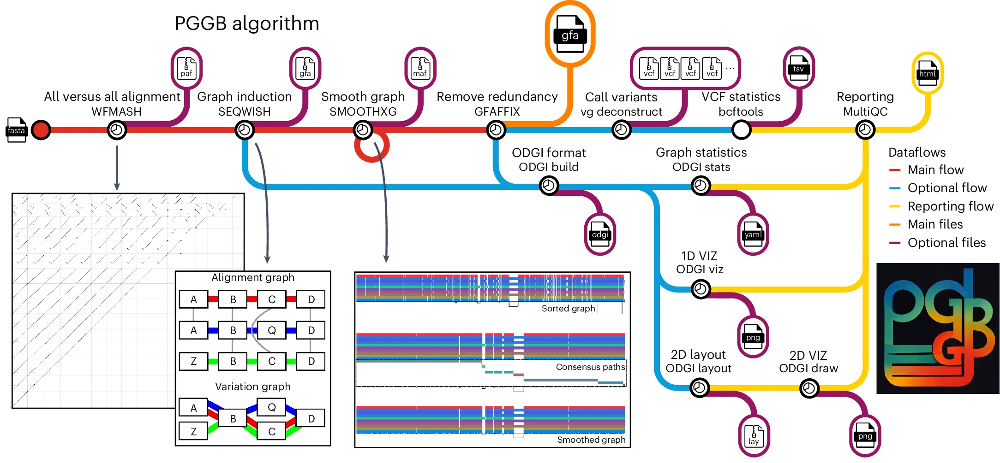

Pull the `pggb` Docker image, which contains all the tools needed for this workshop (`pggb`, `odgi`, `wfmash`, `seqwish`, `smoothxg`, `bedtools`, `samtools`, and more):

    docker pull ghcr.io/pangenome/pggb:2026030920022667bf93

Clone the `pggb` and `odgi` repositories to get the data files used in this workshop:

    cd $HOME
    git clone https://github.com/pangenome/pggb.git
    git clone https://github.com/pangenome/odgi.git

Start an interactive session inside the Docker container, mounting your home directory:

    docker run -it -v $HOME:$HOME -w $HOME -e HOME=$HOME ghcr.io/pangenome/pggb:2026030920022667bf93 /bin/bash

All the following commands should be run inside this Docker container.

### HLA pangenome graphs

The [human leukocyte antigen (HLA)](https://en.wikipedia.org/wiki/Human_leukocyte_antigen) system is a complex of genes on chromosome 6 in humans which encode cell-surface proteins responsible for the regulation of the immune system.

Let's build a pangenome graph from a collection of sequences of the DRB1-3123 gene:

    pggb -i $HOME/pggb/data/HLA/DRB1-3123.fa.gz -o $HOME/out_DRB1_3123.1 -n 12

Why did we specify `-n 12`?

  
Click me for the answer

This parameter is important for the graph normalization with `smoothxg`.
It is used to determine the right partial order alignment (POA) problem size for the multiple sequence alignments.

How many pairwise alignments were used to build the graph (take a look at the `PAF` output)? Visualize the alignments:

    paf2dotplot png large $HOME/out_DRB1_3123.1/*alignments.wfmash.paf

The last command will generate a `out.png` file with a visualization of the alignments.

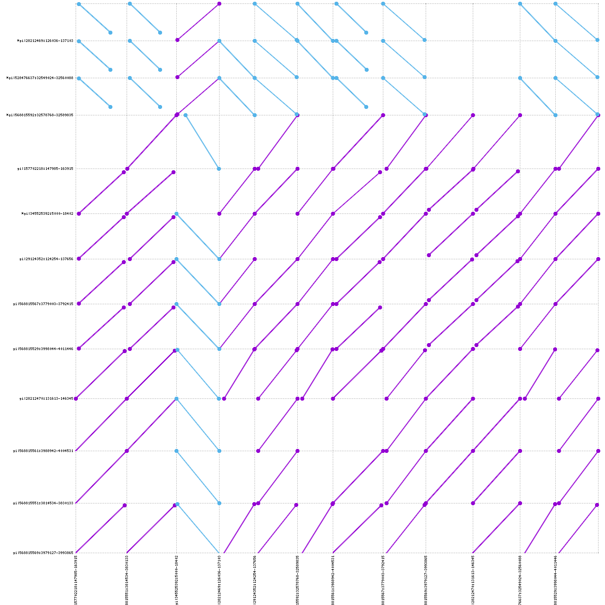

Purple lines indicate that the 2 sequences are aligned in the same orientation.
Blue lines indicate that the 2 sequences are aligned in different orientation.

If `paf2dotplot` does not work, you can use [pafplot](https://github.com/ekg/pafplot) to visualize the alignment.
Its outputs are less appealing, but can scale on big alignments.

Take a look at the files in the `out_DRB1_3123.1` folder.

- `*.alignments.wfmash.paf`: sequence alignments;
- `*.log`: whole log;
- `*.params.yml`: `pggb`'s parameters in `YAML` format;
- `*.gfa`: final pangenome graph in GFA format;
- `*.og`: final pangenome graph in ODGI format (used in `odgi`);
- `*.lay`: graph layout in `LAY` format (used in `odgi`);
- `*.lay.tsv`: graph layout in `TSV` format;

Take a look at the images in the same folder:
- `*.draw.png`: static graph layout representation;
  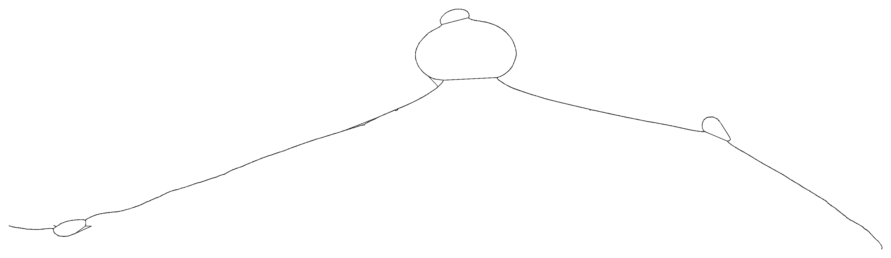
- `*.draw_multiqc.png`: static graph layout representation with sequences as colored lines;
  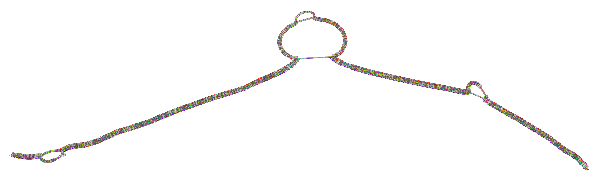

The `*.viz_*.png` images represent the graph in 1 dimension: all nodes are on the horizontal axis, from left to right,
the sequences are represented as colored bars and the graph links are represented as black lines at the bottom of the paths.
Each image follow a different color scheme:
- `*.viz_multiqc.png`: each path has a different color, without any meaning;
  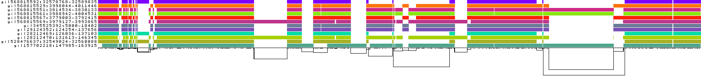

- `*.viz_depth_multiqc.png`: paths are colored by depth. We define **node depth in a path** as the number of times the node is crossed by a path;
  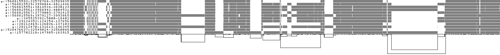

- `*.viz_inv_multiqc.png`: paths are colored with respect to the strandness (black for forward, red for reverse);
  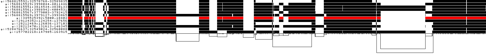

- `.viz_pos_multiqc.png`: paths are colored with respect to the node position in each path. Smooth color gradients highlight well-sorted graphs;
  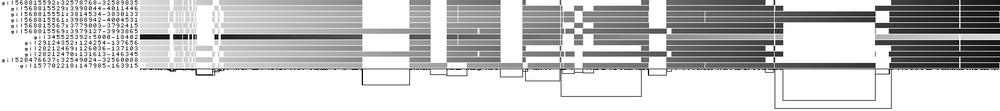

- `*.viz_uncalled_multiqc.png`: uncalled bases (`Ns`) are colored in green;
  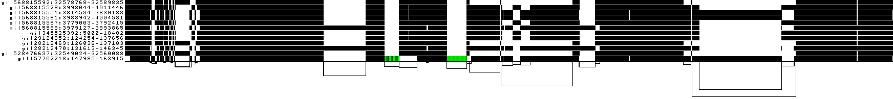

- `*.viz_O_multiqc.png`: all paths are compressed into a single line, where we color by path coverage.
  

Try to visualize the graph also with `Bandage`.

Use `odgi stats` to obtain the graph length, and the number of nodes, edges, and paths:

    odgi stats -i $HOME/out_DRB1_3123.1/DRB1-3123.fa.gz.3d73c94.11fba48.8f32976.smooth.final.og -S

Do you think the resulting pangenome graph represents the input sequences well?
Check the length and the number of the input sequences to answer this question.
To answer, check the length of the input sequences.

  
Click me for the answer

The input sequences are ~13.6Kbp long, on average.
The graph is about 1.6X longer, so not much longer, then it is a good representation of the input sequences.
Pangenome graphs longer than the input sequences are expected because they contain the input sequences plus their variation.

`pggb`'s default parameters assume an average divergence of approximately 10% (`-p 90` by default).
Try building the same pangenome graph by specifying a higher percent identity

    pggb -i $HOME/pggb/data/HLA/DRB1-3123.fa.gz -o $HOME/out_DRB1_3123.2 -n 12 -p 95

Check the graph statistics.
Does this pangenome graph represent better or worse the input sequences than the previously produced graph?

  
Click me for the answer

The graph is much longer than before, about 4.1X longer than the input sequences.
This indicates some under-alignment of all the sequences.
This happens because the HLA locus is highly polymorphic in the population, with great genetic variability.

Try to increase and decrease the segment length (`-s 5000` by default):

    pggb -i $HOME/pggb/data/HLA/DRB1-3123.fa.gz -o $HOME/out_DRB1_3123.3 -n 12 -s 15000
    pggb -i $HOME/pggb/data/HLA/DRB1-3123.fa.gz -o $HOME/out_DRB1_3123.4 -n 12 -s 100

How is this affecting graph statistics?

  
Click me for the answer

This parameter influences the sensitivity in detecting structural variants (SVs) and inversions.
Lower values lead to better resolution of SVs breakpoints and the possibility of detecting shorter inversions,
but at the same time increase the complexity of the graph in terms of the number of nodes and edges.
This happens because short segment lengths lead to catching shorter homologies between the input sequences (that is, more mappings and then alignments).
Higher values reduce sensitivity, but lead to simpler graphs.

Choose another HLA gene from the `data` folder (`A-3105.fa.gz` for example) and explore how the statistics of the resulting graph change as you change the `p` parameter.

### LPA pangenome graphs

[Lipoprotein(a) (LPA)](https://en.wikipedia.org/wiki/Lipoprotein(a)) is a low-density lipoprotein variant containing a protein called apolipoprotein(a).
Genetic and epidemiological studies have identified lipoprotein(a) as a risk factor for atherosclerosis and related diseases, such as coronary heart disease and stroke.

Try to make LPA pangenome graphs.
The input sequences are in `$HOME/pggb/data/LPA/LPA.fa.gz`.
Sequences in this locus have a peculiarity: which one?
Hint: visualize the alignments and take a look at the graph layout with `Bandage` and/or in the `*.draw_multiqc.png` files.
The `*.draw_multiqc.png` files contain static representations of the graph layout.
They are similar to what `Bandage` shows, probably a little less attractive, but such visualizations can scale to larger pangenomic graphs.

### MHC locus

Download the HPRC pangenome graph of the human chromosome 6 in GFA format, decompress it, and convert it to a graph in `odgi` format.

    cd $HOME
    wget https://s3-us-west-2.amazonaws.com/human-pangenomics/pangenomes/scratch/2021_11_16_pggb_wgg.88/chroms/chr6.pan.fa.a2fb268.4030258.6a1ecc2.smooth.gfa.gz
    gunzip chr6.pan.fa.a2fb268.4030258.6a1ecc2.smooth.gfa.gz
    odgi build -g $HOME/chr6.pan.fa.a2fb268.4030258.6a1ecc2.smooth.gfa -o $HOME/chr6.pan.og -t 8 -P

This graph contains contigs of 88 haploid, phased human genome assemblies from 44 individuals, plus the `chm13` and `grch38` reference genomes.

The [major histocompatibility complex (MHC)](https://en.wikipedia.org/wiki/Major_histocompatibility_complex) is a large locus in vertebrate DNA containing a set of closely linked polymorphic genes that code for cell surface proteins essential for the adaptive immune system.
In humans, the MHC region occurs on chromosome 6.
The human MHC is also called the HLA (human leukocyte antigen) complex (often just the HLA).

See the coordinates of some HLA genes.

    head $HOME/odgi/test/chr6.HLA_genes.bed -n 5

The coordinates are expressed with respect to the `grch38` reference genome.

To extract the subgraph containing all the HLA genes annotated in the `chr6.HLA_genes.bed` file, let's prepare a BED with a single interval containing all those genes:

    bedtools merge -i $HOME/odgi/test/chr6.HLA_genes.bed -d 10000000 > chr6.interval_to_extract.bed

and then execute:

    odgi extract -i $HOME/chr6.pan.og -o $HOME/chr6.pan.MHC.og -b $HOME/chr6.interval_to_extract.bed -O -t 8 -P

The instruction extracts:

- the nodes belonging to the `grch38#chr6` path ranges specified in the `chr6.HLA_genes.bed` file via `-b`,
- the edges connecting all the extracted nodes, and
- the paths traversing all the extracted nodes.

How many paths are present in the extracted subgraph?
With 90 haplotypes (44 diploid samples plus 2 haploid reference genomes), how many paths would you expect in the subgraph if the MHC locus were solved with a single contig per haplotype?

  
Click me for the answer

We expect 90 paths in the extracted graph, one for each haplotype.

To visualize the graph, execute:

    odgi viz -i $HOME/chr6.pan.MHC.og -o $HOME/chr6.pan.MHC.png -s '#'

The `-s '#'` parameter is to color each haplotype (not each contig) with a different color .

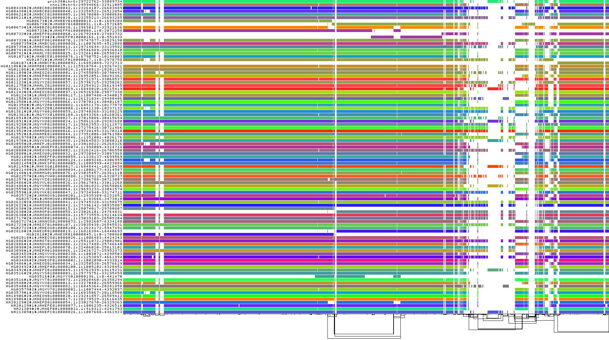

Are there haplotypes where the MHC locus is not resolved with a single contig?
If so, which ones? Counts the number of contigs for each haplotype.

<!-- Generate the graph layout with `odgi layout`:

    odgi layout -i $HOME/chr6.pan.MHC.og -o $HOME/chr6.pan.MHC.lay -t 8 --temp-dir $HOME -P

**IMPORTANT**: The `--temp-dir` parameter is used to specify the directory used for temporary files.
This directory should be on a high-speed disk (like an SSD) to avoid severe slowdowns during the graph layout computation.

Visualize the layout with `odgi draw`:

    odgi draw -i $HOME/chr6.pan.MHC.og -c $HOME/chr6.pan.MHC.lay -p $HOME/chr6.pan.MHC.layout.png -->

### C4 locus

The MHC locus includes the complement component 4 (C4) region, which encodes proteins involved in the complement system.
In humans, the C4 gene exists as 2 functionally distinct genes, C4A and C4B, which both vary in structure and **copy number** ([Sekar et al., 2016](https://doi.org/10.1038/nature16549)).
Moreover, C4A and C4B genes segregate in both long and short genomic forms, distinguished by the **presence or absence** of a human endogenous retroviral (HERV) sequence.

Find C4 coordinates:

    cd $HOME
    wget http://hgdownload.soe.ucsc.edu/goldenPath/hg38/bigZips/hg38.chrom.sizes
    wget https://hgdownload.soe.ucsc.edu/goldenPath/hg38/bigZips/genes/hg38.ncbiRefSeq.gtf.gz
    zgrep 'gene_id "C4A"\|gene_id "C4B"' hg38.ncbiRefSeq.gtf.gz |
      awk '$1 == "chr6"' | cut -f 1,4,5 |
      bedtools sort | bedtools merge -d 15000 | bedtools slop -l 10000 -r 20000 -g hg38.chrom.sizes |
      sed 's/chr6/grch38#chr6/g' > hg38.ncbiRefSeq.C4.coordinates.bed

Extract the C4 locus:

    odgi extract -i $HOME/chr6.pan.og -b $HOME/hg38.ncbiRefSeq.C4.coordinates.bed -o - -O -t 8 -P | odgi sort -i - -o $HOME/chr6.pan.C4.sorted.og -p Ygs -x 100 -t 8 --temp-dir $HOME -P

`odgi sort -p Ygs` will apply three different graph sorting algorithms, the same that are used in `pggb`.

Regarding the `odgi viz` visualization, select the haplotypes to visualize

    odgi paths -i $HOME/chr6.pan.C4.sorted.og  -L | grep 'chr6\|HG00438\|HG0107\|HG01952' > $HOME/chr6.selected_paths.txt

and visualize them

    # odgi viz: default mode
    odgi viz -i $HOME/chr6.pan.C4.sorted.og -o $HOME/chr6.pan.C4.sorted.png -p $HOME/chr6.selected_paths.txt

    # odgi viz: color by strand
    odgi viz -i $HOME/chr6.pan.C4.sorted.og -o $HOME/chr6.pan.C4.sorted.z.png -p $HOME/chr6.selected_paths.txt -z

    # odgi viz: color by position
    odgi viz -i $HOME/chr6.pan.C4.sorted.og -o $HOME/chr6.pan.C4.sorted.du.png -p $HOME/chr6.selected_paths.txt -du

    # odgi viz: color by depth
    odgi viz -i $HOME/chr6.pan.C4.sorted.og -o $HOME/chr6.pan.C4.sorted.m.png -p $HOME/chr6.selected_paths.txt -m -B Spectral:4

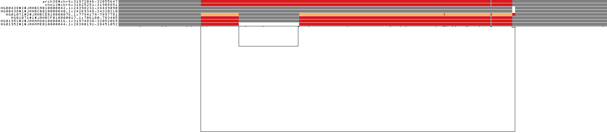

For the `chr6.pan.C4.sorted.m.png` image we used the Spectra color palette with 4 levels of node depths, so white indicates no depth, while grey, red, and yellow indicate depth 1, 2, and greater than or equal to 3, respectively.
What information does this image provide us about the state of the C4 region in the selected haplotypes?

  
Click me for the answer

The two reference genomes have 2 copies of the C4 genes and both of them present the HERV sequence.
HG00348 has 1 copy (HERV sequence included) in both its haplotypes.
HG01071 has the MATERNAL haplotype with 3 copies, with 2 of them without the HERV sequence, and the PATERNAL haplotype with 2 copies of which 1 without the HERV sequence.
HG01952 has the MATERNAL haplotype with 2 copies of which 1 without the HERV sequence, and the PATERNAL haplotype with 2 copies, both of them without the HERV sequence.

Visualize all haplotypes with `odgi viz`, coloring by depth.
How many haplotypes have three copies of the C4 region?
How many haplotypes are missing the HERV sequence?

Use `odgi layout` and `odgi draw` to compute and visualize the layout of the C4 locus.

  
Click me for the answer

    odgi layout -i $HOME/chr6.pan.C4.sorted.og -o $HOME/chr6.pan.C4.sorted.lay -t 8 --temp-dir $HOME -P
    odgi draw -i $HOME/chr6.pan.C4.sorted.og -c $HOME/chr6.pan.C4.sorted.lay -p $HOME/chr6.pan.C4.sorted.layout.png

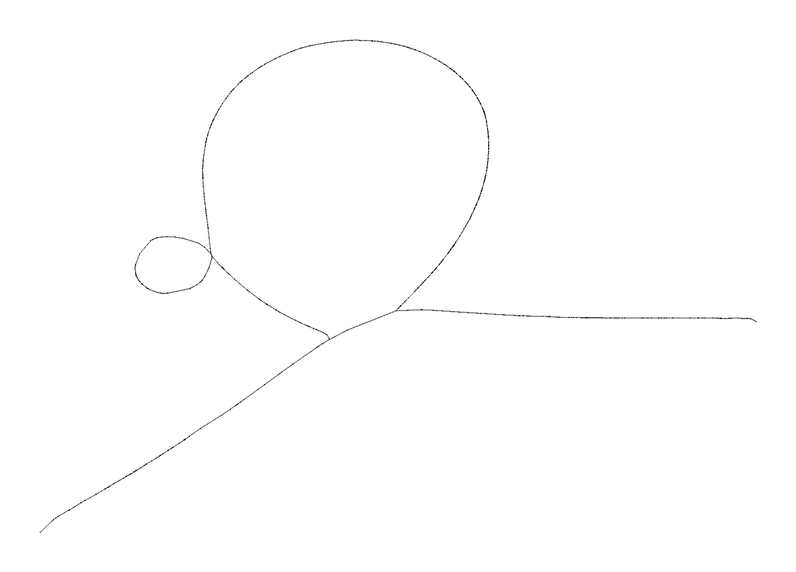

The HERV sequence may be present or absent in the C4 regions across haplotypes: how does this reflect on the structure of the graph layout?

### Graph untangling

To obtain another view of a collapsed locus, we can apply `odgi untangle` to linearize the relationships between paths.

To untangle the C4 graph, execute:

    (echo query.name query.start query.end ref.name ref.start ref.end score inv self.cov n.th |
      tr ' ' '\t'; odgi untangle -i $HOME/chr6.pan.C4.sorted.og -r $(odgi paths -i $HOME/chr6.pan.C4.sorted.og -L | grep grch38) -t 16 -m 256 -P |
      bedtools sort -i - ) | awk '$8 == "-" { x=$6; $6=$5; $5=x; } { print }' |
      tr ' ' '\t'   > $HOME/chr6.pan.C4.sorted.untangle.bed

Take a look at the `chr6.pan.C4.sorted.untangle.bed` file.
For each segment in the query (`query.name`, `query.start`, and `query.end` columns), the best match on the reference is reported (`ref.name`, `ref.start`, and `ref.end`),
with information about the quality of the match (`score`), the strand (`inv`), the copy number status (`self.cov`), and its rank over all possible matches (`n.th`).

<!-- Try to visualize the results with `ggplot2` in R (hint: the intervals in the BED file can be displayed with `geom_segment`).
Compare such a visualization with the visualization obtained with the `odgi viz` coloring by depth. -->

### Annotation injection

A pangenome graph represents the alignment of many genome sequences.
By embedding gene annotations into the graph as paths, we align them with all other paths.

We start with gene annotations against the GRCh38 reference.
Our annotations are against the full `grch38#chr6`, in `test/chr6.C4.bed`.
Take a look at the first column in the annotation file

    head $HOME/odgi/test/chr6.C4.bed

However, the C4 locus graph `chr6.c4.gfa` is over the reference range, that is `grch38#chr6:31972046-32055647`.
With `odgi paths` we can take a look at the names of the paths in the graph:

    odgi paths -i $HOME/chr6.pan.C4.sorted.og -L | grep grc

So, we must adjust the annotations to match the subgraph to ensure that path names and coordinates exactly correspond between the BED and GFA.
We do so using `odgi procbed`, which cuts BED records to fit within a given subgraph:

    odgi procbed -i $HOME/chr6.pan.C4.sorted.og -b $HOME/odgi/test/chr6.C4.bed > $HOME/chr6.C4.adj.bed

The coordinate space now matches that of the C4 subgraph.
Now, we can inject these annotations into the graph:

    odgi inject -i $HOME/chr6.pan.C4.sorted.og -b $HOME/chr6.C4.adj.bed -o $HOME/chr6.C4.genes.og -P

Use `odgi viz` to visualize the new subgraph with the injected paths.

We now use the gene names and the `gggenes` output format from `odgi untangle` to obtain a gene arrow map. We specify the injected paths as target paths:

    odgi paths -i $HOME/chr6.C4.genes.og -L | tail -4 > $HOME/chr6.C4.gene.names.txt

    odgi untangle -R $HOME/chr6.C4.gene.names.txt -i $HOME/chr6.C4.genes.og -j 0.5 -g -t 16 -P > $HOME/chr6.C4.gene.gggenes.tsv

We use `-j 0.5` to filter out low-quality matches.

If you have `R` installed on your local machine, you can plot `odgi untangle` output with `gggenes`:

    require(ggplot2)
    require(gggenes)
    x <- read.delim('$HOME/chr6.C4.gene.gggenes.tsv')
    ggplot(x, aes(xmin=start, xmax=end, y=molecule, fill=gene, forward=strand)) + geom_gene_arrow()
    ggsave('c4.gggenes.png', height=14, width=14)

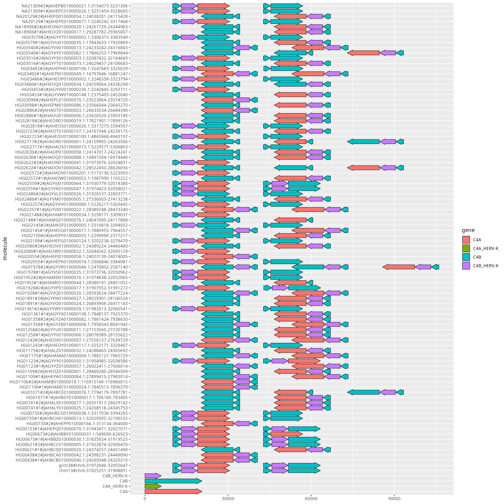

The plot will look a bit odd because some of the paths are in reverse complement orientation relative to the annotations.
We can clean this up by using `odgi flip`, which flips paths around if they tend to be in the reverse complement orientation relative to the graph:

    odgi flip -i $HOME/chr6.C4.genes.og -o $HOME/chr6.C4.genes.flip.og -t 16 -P
    
    odgi untangle -i $HOME/chr6.C4.genes.flip.og -R $HOME/chr6.C4.gene.names.txt -j 0.5 -t 16 -g -P > $HOME/chr6.C4.gene.gggenes.flip.tsv

Plot the new results:

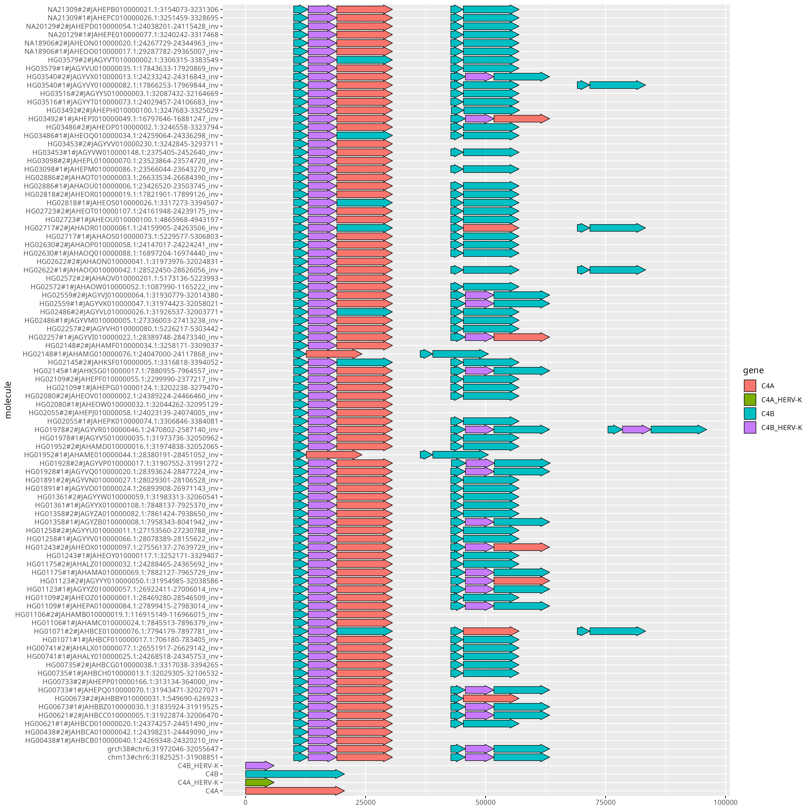

What is changed?

### Hints on implicit pangenomics

Let's download the HPRCv2-vs-GRCh38 alignments in [TracePoint Alignment (TPA) format](https://github.com/AndreaGuarracino/tpa) at [this link](https://drive.google.com/file/d/1TB80ngJJ-aIhpwotb2FM-j0Sna41nWJ7/view?usp=sharing) and the HPRCv2 assemblies in AGC format.

    wget https://s3-us-west-2.amazonaws.com/human-pangenomics/submissions/B4174A5F-F20E-4DCF-8470-F8A907B640BC--HPRCv2_0.6.1_pr_agc_submission/HPRC_r2_assemblies_0.6.1.agc

Then, we can use `impg` to query the alignments to project the C4 locus onto the HPRCv2 assemblies:

    # The first time you run it, the command will be a bit slower because it needs to build index files, which will be used for all subsequent queries.
    impg query \
        -a GCA_000001405.15_GRCh38_no_alt_analysis_set.PanSN.merged.edit-distance.128.tpa \
        --sequence-files HPRC_r2_assemblies_0.6.1.agc \
        -r GRCh38#0#chr6:31972057-32055418 \
        > chr6.C4.impg.bed

We can also extract the sequences of the projected C4 locus:

    # We take a subset of the sequences to speed up the process
    impg query \
      -a GCA_000001405.15_GRCh38_no_alt_analysis_set.PanSN.merged.edit-distance.128.tpa \
      --sequence-files HPRC_r2_assemblies_0.6.1.agc \
      -r GRCh38#0#chr6:31972057-32055418 \
      -o fasta \
      --subset-sequence-list <(sort chr6.C4.impg.bed | head -n 20 | cut -f 1) \
      > chr6.C4.impg.fasta

And then we can build a pangenome graph from the extracted sequences:

    samtools faidx chr6.C4.impg.fasta
    pggb -i chr6.C4.impg.fasta -o chr6.C4.impg.pggb

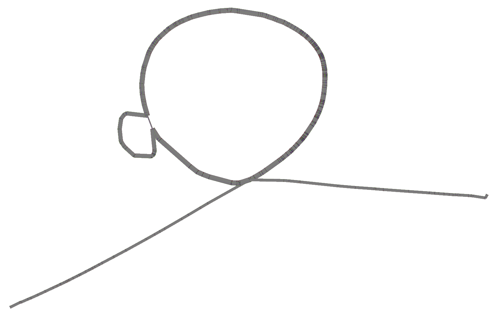

But we are working in integrating explicit pangenome graph construction, so we can directly query the alignments and obtain a pangenome graph in GFA format:

    impg query \
      -a GCA_000001405.15_GRCh38_no_alt_analysis_set.PanSN.merged.edit-distance.128.tpa \
      --sequence-files HPRC_r2_assemblies_0.6.1.agc \
      -r GRCh38#0#chr6:31972057-32055418 \
      -o gfa \
      --subset-sequence-list <(sort chr6.C4.impg.bed | head -n 20 | cut -f 1) \
      > chr6.C4.impg.gfa

Trying with all sequences (it will take ~15 minutes):

    impg query \
      -a GCA_000001405.15_GRCh38_no_alt_analysis_set.PanSN.merged.edit-distance.128.tpa \
      --sequence-files HPRC_r2_assemblies_0.6.1.agc \
      -r GRCh38#0#chr6:31972057-32055418 \
      -o gfa \
      --sparsify auto \
      -t 8 \
      > chr6.C4.impg.all.gfa

`sparsify auto` will automatically apply a sparsification strategy to reduce the number of alignments to compute (remember that all-vs-all alignments means O(N^2) alignments, where N is the number of sequences).

Let's apply the "next generation" of static graph visualization with [`gfalook`](https://github.com/pangenome/gfalook) by clustering the paths in the graph:

    gfalook -i chr6.C4.impg.all.gfa -o chr6.C4.impg.all.dendogram.png -k -D -m -B Spectral:4

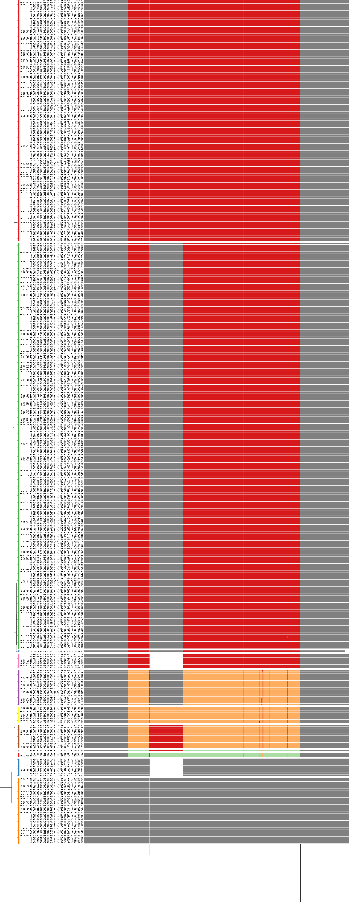

Too many paths. Let's select a representative for each cluster:

    gfalook -i chr6.C4.impg.all.gfa -o chr6.C4.impg.all.dendogram.repr.png -k -D -m -B Spectral:4 -K

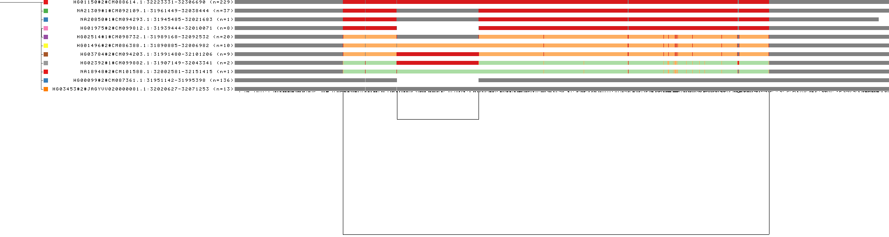
